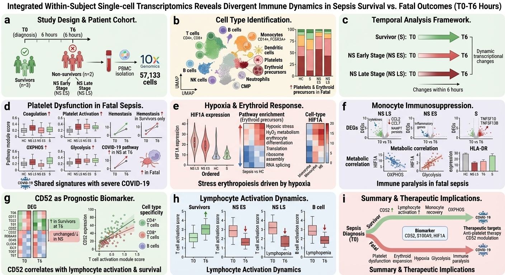

# sepsis-scrna-dynamics

[](https://doi.org/10.1002/JLB.5MA0721-825R)
[](https://opensource.org/licenses/MIT)

This repository contains the analysis code for the paper **"Dynamic changes in human single-cell transcriptional signatures during fatal sepsis"** (Qiu et al., 2021, *Journal of Leukocyte Biology*).

## Overview


This project analyzes single-cell RNA sequencing data from peripheral blood mononuclear cells (PBMCs) of sepsis patients to understand the molecular dynamics during the critical early hours of sepsis progression. The analysis includes:

- Processing of 10X Genomics single-cell RNA-seq data
- Cell type identification and annotation
- Differential expression analysis between survivors and non-survivors
- Temporal trajectory analysis of immune cell populations
- Investigation of platelet and erythroid precursor responses
- Analysis of monocyte transcriptional changes
- CD52 expression analysis in lymphocytes

---

## Mathematical Methods

### 1. Quality Control as Constrained Filtering

Each cell $i$ is a count vector $\mathbf{x}_i \in \mathbb{N}_0^{G}$. A cell is retained iff it satisfies the constraint set

$$n_{\min} \ \le\  \big|\{ g : x_{ig} > 0 \}\big| \ \le\  n_{\max}, \qquad \mathrm{pct}_{\mathrm{mt}}(i) = \frac{\sum_{g \in \mathcal{MT}} x_{ig}}{\sum_{g=1}^{G} x_{ig}} \times 100 \ \le\  \tau_{\mathrm{mt}},$$

removing both empty droplets (low gene count) and stressed/lysing cells (high mitochondrial fraction $\mathcal{MT}$).

### 2. Library-Size Normalization

$$\tilde{x}_{ig} = \log\left(1 + 10^{4} \cdot \frac{x_{ig}}{\sum_{g'=1}^{G} x_{ig'}}\right),$$

which renders cells comparable under the Poisson/multinomial sampling model of UMI counts and stabilizes the mean–variance relationship.

### 3. Differential Expression: MAST Hurdle Model

Survivor vs. non-survivor differential expression is tested gene-by-gene with a two-part **hurdle model**. With $z_{ig} = \mathbb{1}[\tilde{x}_{ig} > 0]$ the detection indicator,

$$\mathrm{logit} P(z_{ig} = 1) = \mathbf{c}_i^{\top}\boldsymbol{\beta}_g^{\mathrm{disc}}, \qquad \tilde{x}_{ig} \mid (z_{ig} = 1) \sim \mathcal{N}\left(\mathbf{c}_i^{\top}\boldsymbol{\beta}_g^{\mathrm{cont}},\ \sigma_g^2\right),$$

where $\mathbf{c}_i$ encodes outcome group and cellular detection rate (a proxy for technical depth). The discrete component captures changes in *detection frequency*, the continuous component changes in *expression magnitude*; a combined $\chi^2$ test on $(\boldsymbol{\beta}^{\mathrm{disc}}, \boldsymbol{\beta}^{\mathrm{cont}})$ followed by Benjamini–Hochberg correction yields FDR-controlled calls at $q = 0.05$.

### 4. Compositional Shift Analysis

Temporal remodeling of the immune compartment within 6 h of diagnosis is tested on cell-type proportions. For cell type $k$ at time $t$, with counts $n_k^{(t)}$ over total $N^{(t)}$, proportion differences are assessed by a two-proportion $z$-test,

$$z = \frac{\hat{p}_k^{(t_1)} - \hat{p}_k^{(t_2)}}{\sqrt{\hat{p}(1-\hat{p})\left(1/N^{(t_1)} + 1/N^{(t_2)}\right)}}, \qquad \hat{p}_k^{(t)} = \frac{n_k^{(t)}}{N^{(t)}},$$

which revealed the early expansion of platelet and erythroid precursors in non-survivors.

### 5. Trajectory Ordering

Cells are ordered along a learned principal graph on the low-dimensional embedding; pseudotime is the geodesic distance from the root state,

$$\tau(i) = d_{\mathcal{G}}\left(\mathrm{proj}_{\mathcal{G}}(\mathbf{u}_i),\ \text{root}\right),$$

recovering the monocyte and lymphocyte transcriptional trajectories that diverge between outcome groups.

### 6. Gene Set Enrichment

For pathway set $\mathcal{S}$ ranked by the differential statistic, enrichment is scored by a Kolmogorov–Smirnov-like running sum over the ranked list $L$:

$$\mathrm{ES}(\mathcal{S}) = \max_{1 \le j \le G} \left| \sum_{\substack{g \in \mathcal{S} \\ \mathrm{rank}(g) \le j}} \frac{|r_{(g)}|^{\alpha}}{N_R} - \sum_{\substack{g \notin \mathcal{S} \\ \mathrm{rank}(g) \le j}} \frac{1}{N - N_R} \right|, \qquad N_R = \sum_{g \in \mathcal{S}} |r_{(g)}|^{\alpha},$$

with significance from phenotype-label permutation (hypergeometric test for over-representation via `clusterProfiler`).

---

## Data Availability

The raw data have been deposited in the Gene Expression Omnibus (GEO) under accession number [GSE167363](https://www.ncbi.nlm.nih.gov/geo/query/acc.cgi?acc=GSE167363).

## Prerequisites

### Software Requirements
- R >= 4.0.0
- Cell Ranger >= 3.1.0

### R Packages
```R
install.packages(c("Seurat", "dplyr", "ggplot2", "patchwork"))
BiocManager::install(c("SingleR", "MAST", "clusterProfiler"))
```

## Installation

```bash
# Clone the repository
git clone https://github.com/xqiu625/sepsis-scrna-dynamics.git
cd sepsis-scrna-dynamics

# Set up R environment
conda env create -f environment.yml
conda activate sepsis-scrna

# Install R dependencies
Rscript src/utils/install_packages.R
```

## Usage

### 1. Data Preprocessing
```bash
# Process raw 10X data
bash src/preprocessing/cellranger_processing.sh

# Perform QC and filtering
Rscript src/preprocessing/qc_filtering.R
```

### 2. Main Analysis
```R
# Run Seurat analysis pipeline
Rscript src/analysis/seurat_integration.R
Rscript src/analysis/cell_type_annotation.R
Rscript src/analysis/differential_expression.R
```

### 3. Generate Figures
```R
# Create visualization plots
Rscript src/visualization/Figures_from_manuscript.R
```

## Project Structure


For detailed directory structure, see [docs/pipeline.md](docs/pipeline.md).

## Results

The analysis reveals:
- Dynamic changes in immune cell populations within 6 hours of sepsis diagnosis
- Platelet and erythroid precursor responses as drivers of fatal sepsis
- Transcriptional signatures shared with severe COVID-19
- CD52 as a potential prognostic biomarker
- Hypoxic stress as a driving factor in immune dysfunction


## Citation

If you use this code in your research, please cite:

```bibtex
@article{qiu2021dynamic,
  title={Dynamic changes in human single-cell transcriptional signatures during fatal sepsis},
  author={Qiu, Xinru and Li, Jiang and Bonenfant, Jeff and Jaroszewski, Lukasz and Mittal, Aarti and Klein, Walter and Godzik, Adam and Nair, Meera G},
  journal={Journal of Leukocyte Biology},
  volume={110},
  number={6},
  pages={1253--1268},
  year={2021},
  publisher={Wiley Online Library}
}
```

## License

This project is licensed under the MIT License - see the [LICENSE](LICENSE) file for details.

## Acknowledgments

This research was supported by:
- UCR School of Medicine
- Dean Innovation Fund
- National Institutes of Health (NIAID, R21AI37830, and R01AI153195)
